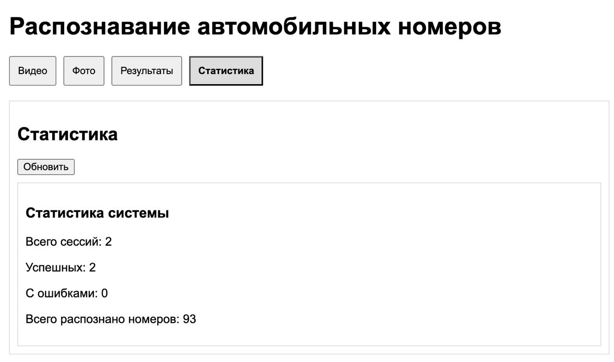

# Система детекции автомобилей и распознавания номерных знаков в режиме реального времени

## Демонстрация работы системы

<div align="center">
  
</div>

## Обзор проекта

Веб-сервис для автоматической детекции автомобилей и распознавания их номерных знаков с использованием технологий компьютерного зрения. Система поддерживает обработку как фотографий, так и видео в режиме реального времени.

**Основные возможности:**
- Детекция автомобилей на фото и видео
- Локализация номерных знаков на обнаруженных автомобилях
- Обработка видеопотока в реальном времени
- Сохранение и анализ результатов

### Примеры работы веб-интерфейса

#### Обработка видео


#### Обработка фото


#### Просмотр результатов


#### Статистика


## Архитектура решения

### Стек технологий
- **Backend:** Python3, FastAPI, Uvicorn, Pydantic
- **Frontend:** HTML/CSS, JavaScript
- **ML:** YOLOv8, OpenCV, EasyOCR
- **Logger:** loguru
- **DB:** SQLite, SQLAlchemy

### Архитектура системы


## Цель проекта

В первую очередь проект направлен на ресерч в сфере компьютерного зрения в области распознавания автомобильных номеров.

### Возможные направления практического применения
1. Подсчёт автомобилей на парковке
2. Трекинг и аналитика трафика
3. Контроль стоянки в зонах с ограниченным временем
4. Мониторинг очередей на въезд/выезд

## Реализация

### Подход к решению задачи

Для эффективного распознавания автомобильных номеров была разработана следующая система:

1. **Детекция автомобилей**
   - Использование YOLOv8 для обнаружения автомобилей на изображении
   - Выделение области интереса для дальнейшей обработки
   - Фильтрация ложных срабатываний на основе уверенности модели

2. **Детекция номерных знаков**
   - Применение YOLOv12 для точного определения положения номерных знаков
   - Обработка каждого обнаруженного автомобиля отдельно
   - Дополнительная валидация результатов по размеру и пропорциям

3. **Распознавание текста**
   - Использование EasyOCR для извлечения текста с номерных знаков
   - Постобработка результатов с учетом формата российских номеров
   - Валидация результатов по регулярным выражениям

### Обучение моделей

#### Вычислительные ресурсы

Обучение проводилось на платформе Kaggle с использованием GPU NVIDIA Tesla P100:
- Суммарно затрачено около 300 GPU-часов
- Использовано 250+ GB дискового пространства для датасетов
- Задействовано до 32GB RAM для обработки данных

#### Стратегия аугментации данных

Для повышения устойчивости моделей к различным условиям съемки применялись следующие  аугментации:

**Базовые преобразования:**
- Случайное изменение яркости и контраста
- Горизонтальное отражение
- Случайное размытие
- Добавление шума

**Специальные аугментации:**
- Мозаичное объединение изображений
- Имитация сложных погодных условий
- Искажение геометрии
- Добавление бликов и засветов

### Оптимизация производительности

#### Оптимизация моделей

Для улучшения производительности были применены следующие оптимизации:
- Использование предварительно обученных весов
- Оптимизация размера входных изображений
- Балансировка между точностью и скоростью обработки

### Результаты тестирования

#### Производительность

**На MacBook M3 (18GB RAM):**
- Обработка фото: 0.3-0.5 сек
- Обработка видео: 20-25 FPS


**На GPU (NVIDIA RTX 3060 Ti):**
- Обработка фото: 0.1-0.2 сек
- Обработка видео: 35-40 FPS

#### Метрики моделей

**Детекция автомобилей (YOLOv8):**
- mAP50: 92.8%
- mAP75: 88.5%
- Recall: 91.4%

**Детекция номерных знаков (YOLOv12 + YOLOv8):**
- mAP50: 83.2%
- mAP75: 78.6%
- Recall: 81.9%

### Обработка видео

#### Реализация обработки видео
Система поддерживает обработку видео в режиме реального времени с использованием асинхронного подхода:

1. **Параллельная обработка кадров:**
   - Использование asyncio для асинхронного чтения кадров
   - Многопоточная обработка для распараллеливания детекции
   - Буферизация кадров для плавного воспроизведения

2. **Оптимизация производительности:**
   - Пропуск кадров при высокой нагрузке
   - Адаптивное изменение разрешения
   - Кэширование результатов детекции

3. **Особенности реализации:**
   - Возможность обработки потока с веб-камеры
   - Сохранение результатов в реальном времени

#### Метрики производительности видео

**Обработка записанного видео:**
- Full HD (1920x1080): 20-25 FPS
- HD (1280x720): 30-35 FPS
- SD (640x480): 40-45 FPS

**Обработка потока с камеры:**
- Full HD (1920x1080): 15-20 FPS
- HD (1280x720): 25-30 FPS
- SD (640x480): 35-40 FPS


## Результаты проекта

### Достигнутые цели
- Проведено исследование современных подходов к распознаванию автомобильных номеров
- Успешно дообучены модели YOLO для детекции номерных знаков и автомобилей
- Реализован полноценный веб-сервис с API

### Текущие ограничения
- Недостаточное качество распознавания текста номеров из-за отсутствия качественного датасета для обучения
- Как временное решение использован готовый EasyOCR

## Реализованные требования

### Основные требования (44 баллов):
1. **Консольный интерфейс (CLI)** - 5 баллов
   - Обработка фото и видео через командную строку
   - Поддержка различных форматов входных данных
   - Гибкая настройка параметров обработки

2. **Работа с файлами** - 5 баллов
   - Загрузка и сохранение медиафайлов
   - Экспорт результатов в различных форматах
   - Управление временными файлами

3. **REST API** - 10 баллов
   - `/api/v1/detect/photo` - обработка фотографий
   - `/api/v1/detect/video` - обработка видео
   - `/api/v1/results` - получение результатов
   - `/api/v1/stats` - статистика работы системы

4. **База данных (SQLite)** - 10 баллов
   - Хранение результатов обработки
   - Метаданные обработанных файлов
   - Статистика распознавания

5. **Интеграция ML моделей** - 10 баллов
   - YOLOv8 для детекции автомобилей
   - YOLOv12 для распознавания номеров
   - EasyOCR для извлечения текста

6. **Типизация Python** - 2 балла
   - Type hints во всех модулях
   - Pydantic модели для валидации данных

7. **Логирование** - 2 балла
   - Структурированное логирование с loguru
   - Ротация логов
   - Различные уровни детализации

### Дополнительные требования:
8. **Асинхронная обработка** - 15 баллов
   - Асинхронные эндпоинты FastAPI
   - Параллельная обработка видеопотоков
   - Очереди задач

## Инструкция по запуску

1. Клонировать репозиторий:
```bash
git clone https://github.com/yourusername/your-repo-name.git
cd your-repo-name
```

2. Создать виртуальное окружение и активировать его:
```bash
python -m venv venv
source venv/bin/activate  # для Linux/MacOS
# или
venv\Scripts\activate  # для Windows
```

3. Установить зависимости:
```bash
pip install -r requirements.txt
```

4. Запустить сервер:
```bash
uvicorn main:app --host 0.0.0.0 --port 8001
```

5. Открыть веб-интерфейс:
- Перейти в браузере по адресу http://localhost:8001
- Загрузить фото или видео для обработки
- Получившийся результат можно скачать

## Исследование существующих решений

### OpenALPR

**Сайт:** [openalpr.com](https://www.openalpr.com/)

**Технологический стек:**
- **Язык программирования:** C++
- **Библиотеки:**
  - OpenCV – для обработки изображений
  - Tesseract OCR – для распознавания текста

**Особенности:**
- Поддержка более 70 стран, включая Россию
- Платная подписка с различными тарифами


### Sighthound ALPR+

**Сайт:** [sighthound.com/products/alpr](https://www.sighthound.com/products/alpr)

**Особенности:**
- Коммерческое решение с точностью ~99% и скоростью до 160 FPS на GPU
- Распознавание номера, типа авто, ориентации, марки, модели и цвета
- REST API и возможность интеграции


## План работы и реализация

### План работы

**Анализ требований:**
- CLI, работа с файлами, REST API (минимум 4 endpoint), интеграция с БД, ML (YOLO)
- Типизация и логирование
- Дополнительно: асинхронность, сторонние API, улучшение алгоритмов

**Поиск и подготовка датасетов:**
- Поиск общедоступных датасетов
- Очистка, аугментация и аннотация для YOLO

**Выбор и обучение модели:**
- Анализ существующих решений (OpenALPR, Sighthound ALPR+ и др.)
- Настройка и обучение YOLO модели, валидация, оптимизация

**Разработка бэкенда:**
- Создание REST API с FastAPI (загрузка, получение результатов, CRUD, мониторинг)
- Реализация CLI, работа с файлами и логирование

**Интеграция с базой данных:**
- Выбор БД (SQLite), разработка схемы, реализация CRUD-операций

**Тестирование:**
- Тестирование всех компонентов

### Данные для обучения

#### Проблематика датасетов
Основная сложность заключалась в отсутствии качественного датасета, содержащего как целые изображения автомобилей, так и правильную расшифровку их номерных знаков. Даже при наличии такого датасета возникает проблема с несколькими автомобилями на одном изображении.

Возможные решения:
- Создание собственного датасета
- Использование данных из открытых источников (например, номерограм)
- Начало с базовой версии на качественных фото
- Постепенное усложнение с помощью аугментаций

#### Используемый датасет
Для обучения был выбран специализированный датасет с Kaggle, содержащий обрезанные изображения номеров с разметкой:
[Russian License Plates Dataset](https://www.kaggle.com/datasets/evgrafovmaxim/nomeroff-russian-license-plates/data)

Преимущества датасета:
- Содержит размеченные номерные знаки
- Включает примеры с различным качеством изображения
- Содержит номера с загрязнениями и повреждениями
- Подходит для применения аугментаций

**Примеры из датасета:**

Исходное изображение:


Разметка:


#### Датасет для детекции номеров
Для обучения модели детекции номерных знаков на фотографиях автомобилей был использован датасет с Roboflow:
[Russia Car Plate Dataset](https://universe.roboflow.com/kolzek/russia-car-plate)

**Пример разметки из датасета:**


#### Датасет для детекции автомобилей
Для обучения модели детекции автомобилей использовался датасет с Kaggle:
[Car Object Detection Dataset](https://www.kaggle.com/datasets/sshikamaru/car-object-detection)

**Особенности датасета:**
- 15,000+ размеченных изображений автомобилей
- Разнообразные условия съемки (день/ночь, разная погода)
- Различные типы автомобилей (легковые, грузовые, автобусы)
- Высококачественная разметка в формате YOLO

**Преимущества датасета:**
- Большой объем данных для обучения
- Реалистичные сценарии использования
- Разнообразие условий съемки
- Готовая разметка в формате YOLO

**Пример разметки из датасета:**


